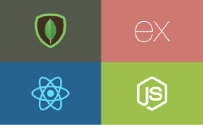

<h1>Hey there, I'm <a  href="https://https://github.com/sadiqabubakar526">SURAJ ABUBAKAR </a> </h1>

#### It's good to see you here 😄 

Undergrad student of BS-CS NEDUET. Resourceful developer, Enjoy problem solving and creating helpful, reliable user experiences for online tech
companies.

#### Unusual Stuff😄
- 🌱 I’m currently learning Flutter & dart
- 💬 Ask me anything about JavaScript stuff
- 📫 How to reach me: suraj.surajabubakar443@gmail.com 

#### Stack :blue_book:

- :paperclip: HTML / CSS / SCSS /Flutter / PHP 
- :paperclip: JavaScript / React / jquery /Bootstrap.
- :paperclip: Knowledge of Linux, Docker and Kubernetes.
- :paperclip: Knowledge of front end Wordpress development.

## MY GIT STATS
|||
|---|---|

## MY TOP LANGUAGES

